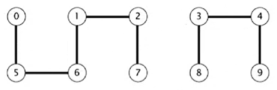
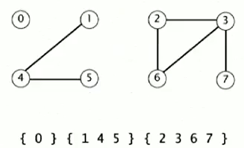

# :books: Summary

1. [Dynamic Connectivity](#dynamic-connectivity)
    - [The Problem](#the-problem)
    - [Applications](#applications)
    - [Modeling the Connections](#modeling-the-connections)
    - [Connected Components](#connected-components)
    - [Goal](#goal)
    - [Pseudo Design to solve the problem](#pseudo-design-to-solve-the-problem)

# Dynamic Connectivity

Dynamic Connectivity is the model of the problem solved by Union Find

## The Problem

**Given a set of N objects.**
  - Union command: Connect two objects
  - Find/connected query: Is there a path connecting the two objects?



In the example above:

- connected(0, 7) :heavy_check_mark:
- connected(1, 4) :x:

## Applications

Here are some examples of applications where algorithms were used to solve the problem of Dynamic Connectivity:

- Pixels in a digital photo
- Computers in a network
- Friends in a social network
- Transistors in a computer chip
- Elements in a mathematical set
- Variable names in Fortran program
- Metallic sites in a composite system

## Modeling the connections

We have to assume some abstract properties that each connection has to satisfy:

- **Reflexive**: *p* is connected to *p*.
- **Symmetric**: if *p* is connected to *q*, then *q* is connected to *p*
- **Transitive**: if *p* is connected to *q* and *q* is connected to *r*, then *p* is connected to *r*.

## Connected Components

When we have a equivalence relation, a set of objects and connections divide into subsets called *Connected Componentes*. 

A Connected Component is a maximal *set* of objects that are mutually connected.

In the example below we have 3 Connected Components:



## Goal

In the programming world, our goal here is "design" a efficient data structure for union-find. Attending the following criteria:

- Number of objects *N* can be huge
- Number of operations *M* can be huge
- Find queries and union commands may be intermixed

## Pseudo design to solve the problem

```Java
public class UF
{
  UF(int N) 
  {
    // Initialize union-find data structure with N objects (0 to N-1)
  }

  void union(int p, int q) 
  {
    // Add conection between p and q
  }

  boolean connected(int p, int q) 
  {
    // are p and q in the same connected component?
  }
}
```
The ***Client*** responsible for using the data structure developed:

```Java
/*
  The client read in number of objects N from standard input

  Then, it reads two intergers from the input and, if they are not yet connected, connect them and print out pair. If they are connected, it will ignore
*/

public static void main(String[] args) 
{
  int N = StdIn.readInt();
  UF uf = new UF(N);
  while (!StdIn.isEmpty())
  {
    int p = StdIn.readInt();
    int q = StdIn.readInt();
  
    if (!uf.connected(p, q)) 
    {
      uf.union(p, q);
      StdOut.println(p + "" + q);
    }
  }
}
```
