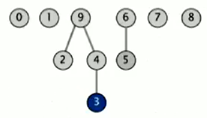

# :books: Summary

1. [Quick Union](#quick-union)
    - [Data Structure](#data-structure)
      - [Find Implementation](#find-implementation)
      - [Union Implementation](#union-implementation)
    - [Java Implementation :coffee:](#java-implementation-coffee)
    - [Cost Model](#cost-model)
      - [Comparision between Quick Find and Quick Union defects](#comparision-between-quick-find-and-quick-union-defects)

# Quick Union

As Quick Find being too slow for huge problems, we can try an alternative named Quick Union. 

If Quick Find was commonly called an eager approach, this one is so-called lazy approach because we try to avoid doing work until we have to

## Data Structure

As in Quick Find, the Data Structure used to support the algorithm is simply an integer array of size *N* called ***id[]***.

But the catch is how we interpret it. We are goingto think of the array ***id[]*** as representing a set of trees (a forest? :evergreen_tree:) as the following picture suggest:



Each entry in the array is going to contain a reference to it's parent in the three:

| *0* | *1* | *2* | *3* | *4* | *5* | *6* | *7* | *8* | *9* |
|---|---|---|---|---|---|---|---|---|---|
| 0 | 1 | 9 | 4 | 9 | 6 | 6 | 7 | 8 | 9 |

> ***Example*** <br>
> 3's parent = 4 <br>
> 4's parent = 9 <br>
> So 3's entry is 4 and 4 entry is 9 in the array <br>
> (**id[3] = 4; id[4] = 9**) <br>

**This mean each entry in the array has associated with it a root. That's the root of its tree.**

The definition of **Root** says the following:
> **Root** of *i* is id[id[id[...id[*i*]...]]]
>
> *keep going until it doesn't change (algorithm ensures no cycle)*

Using the picture from above as an example, we can tell what are the roots of some objects:

> *Root* of 3 is 9 <br>
> *Root* of 5 is 6 <br>
> 3 and 5 are *not* connected

### Find Implementation

Once we can calculate the roots of an object, we can implement the Find operation just by checking wheter the two items have the same root. That's equivalent to saying, are they in the same connective component (or tree!)

Definitely this is some costly operation, but, as we will see, the union operation is very easy and may compensate (or not..)

### Union Implementation

To merge components containing *p* qnd *q*, all we need to do is set the id of *p's* root to the id of *q's* root. This will make *p's* tree point to *q*.

## Java Implementation :coffee:

```Java
// Creates QuickUnion class to solve the Dynamic Connectivy
public class QuickUnionUF
{
  private int[] id;

  public QuickUnionUF(int N)
  {
    id = new int[N];
    for (int i = 0; i < N; i++)
      id[i] = i;  // set id of each object to itself (N array accesses)
  }

  private int root(int i)
  {
    // chase parent pointer until reach root (depth of i array accesses)
    while (i != id[i]) i = id[i];
    return i;
  }

  public boolean connected(int p, int q)
  {
    // check if p and q have same root (depth of p and q array accesses)
    return root(p) == root(q);
  }

  public void union(int p, int q)
  {
    // change root of p to point to root of q (depth of p and q array accesses)
    int i = root(p);
    int j = root(q);
    id[i] = j;
  }
}
```

## Cost Model

The cost model here is basically how many times we need to access the array (for read or write)

| algorithm | constructor | union | connected |
|----|-----|----|----|
| quick-find | N | N | 1 |
| **quick-union** | **N** | **N*** | **N** |

> *includes cost of finding roots

This means Quick Union ends up being *slower* than Quick Find in the *worst case* because trees can get too tall

### Comparision between Quick Find and Quick Union defects

Quick Find defects:
- Union too expensive (*N* array accesses)
- Trees are flat, but too expensive to keep them flat

Quick Union defects:
- Trees can get tall
- Find too expensive (could be *N* array access)